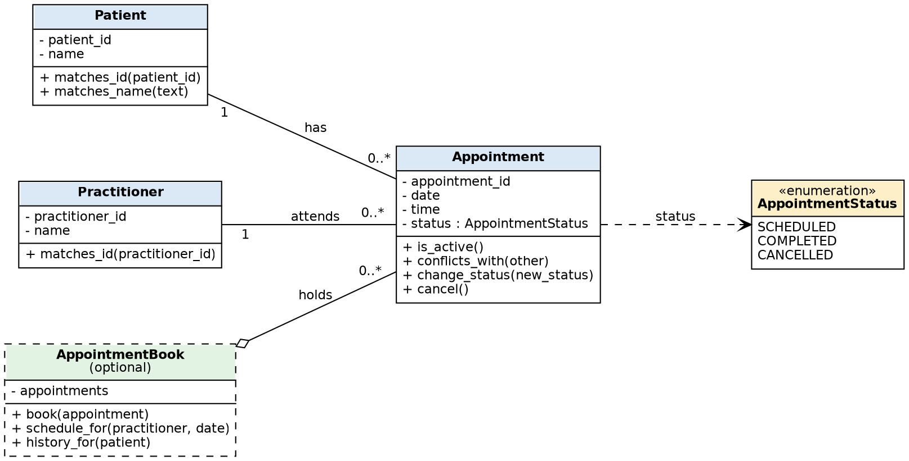

# SmartCare v0.3 - Domain Model Workbook

*Source: SmartCare Requirements Specification v0.2 (FR-01 to FR-12, NFR-01 to NFR-06). FR-07, FR-08 and FR-12 are provisional, so anything that depends only on them is marked provisional too.*

## A. Requirements Review - nouns, verbs, business rules

**Nouns:** patient, practitioner, appointment, patient ID, practitioner ID, name, date, time, status (Scheduled / Completed / Cancelled), history, schedule, record, message.

**Verbs:** create (patient, practitioner), book, reject, find / search, display, cancel, change status, retain.

**Business rules**
| Rule | Source |
|---|---|
| A patient ID and a practitioner ID are unique. | FR-01, FR-02 |
| An appointment needs an existing patient and an existing practitioner, plus a valid date and time. | FR-03, FR-05, NFR-01 |
| A practitioner cannot have two non-cancelled appointments at the same date and time. | FR-04, NFR-01 |
| An appointment has exactly one status from a fixed list. | FR-09 |
| Cancelling changes the status; the appointment is never deleted. | FR-10 |
| History includes Completed and Cancelled appointments. | FR-11 |
| Some status changes are not allowed (e.g. Cancelled to Completed). | FR-12 (provisional) |

## B. Requirement-to-Concept Trace (candidate classes)

| Requirement | Concept | State / behaviour | Decision |
|---|---|---|---|
| FR-01, FR-06, FR-07 | **Patient** | State: patient_id, name. Behaviour: match by ID, match by name. | **Class** |
| FR-02, FR-08 | **Practitioner** | State: practitioner_id, name. Behaviour: match by ID. | **Class** |
| FR-03, FR-04, FR-09, FR-10, FR-12 | **Appointment** | State: id, patient, practitioner, date, time, status. Behaviour: is_active, conflicts_with, change_status, cancel. | **Class** |
| FR-09 | **AppointmentStatus** | Fixed set of three values. | **Enumeration** (value type, not a full class) |
| FR-04, FR-08, FR-11 | **AppointmentBook** (optional) | State: collection of appointments. Behaviour: book, schedule_for, history_for. | **Optional class**, kept because rules about *many* appointments belong somewhere. A single Appointment cannot see the others. |
| FR-01, FR-02 | Name, ID, date, time | Simple values | **Attributes**, not classes |
| FR-10 | Cancellation | An action that changes status | **Operation** `cancel()`, not a class |
| FR-11 | History | A query over appointments | **Operation** `history_for()`, not a class |
| (none) | Clinic, Database | Not a domain concept in any FR; a database is an implementation detail | **Rejected** |

## C. CRC Cards

**Patient**
| Responsibilities | Collaborators |
|---|---|
| Know its patient ID and name | (none) |
| Say whether it matches a given ID or name | (none) |

**Practitioner**
| Responsibilities | Collaborators |
|---|---|
| Know its practitioner ID and name | (none) |
| Say whether it matches a given ID | (none) |

**Appointment**
| Responsibilities | Collaborators |
|---|---|
| Know its patient, practitioner, date, time and status | Patient, Practitioner, AppointmentStatus |
| Say whether it is still active (not Cancelled) | AppointmentStatus |
| Say whether it conflicts with another appointment | Appointment |
| Change status only when the change is allowed | AppointmentStatus |
| Cancel itself without being deleted | AppointmentStatus |

**AppointmentBook (optional class)**
| Responsibilities | Collaborators |
|---|---|
| Hold all appointments | Appointment |
| Reject a booking that conflicts or has invalid data | Appointment, Patient, Practitioner |
| Return a practitioner's schedule for a date | Appointment, Practitioner |
| Return a patient's full history | Appointment, Patient |

## D. UML Class Diagram

Files: `uml_class_diagram.png`, `uml_class_diagram.svg`, source `uml_class_diagram.dot`.

| Relationship | Multiplicity | Reasoning |
|---|---|---|
| Patient - Appointment | 1 to 0..* | One patient can have many appointments (history, FR-11). Every appointment belongs to exactly one patient. A new patient may have none. |
| Practitioner - Appointment | 1 to 0..* | A practitioner has many appointments, each with exactly one practitioner. |
| Appointment -> AppointmentStatus | exactly one | FR-09. |
| AppointmentBook o-- Appointment | 0..* | The book collects appointments. Aggregation, not composition, since appointments are still meaningful objects that refer to a patient and practitioner. |

Patient and Practitioner are **not** linked directly: they are related only through an Appointment.

## Design Rationale
Three classes come from the three records the brief says management needs: patients, practitioners and appointments. Each has an ID and name or a date/time, so they have state and their own rules. Responsibilities follow the data. Patient and Practitioner only know and identify themselves. Appointment owns the rules about itself (active, conflict, status changes, cancel).

Rules that involve many appointments (no double booking, schedule, history) cannot sit inside one Appointment, so I added one small optional class, AppointmentBook, instead of a Manager class for each concept. Status is an enumeration because the list is fixed and has no behaviour. Cancellation and history are an operation and a query, not classes. I left out Clinic and Database because no requirement needs them, and I kept Appointment as an association between a patient and a practitioner rather than a subclass (an appointment *is not* a patient).

## E-F. AI Design Review Record

**Prompt used (Part E):**
> Act as a software designer. Using ONLY the confirmed requirements in SmartCare v0.2, suggest domain classes and relationships. For every suggestion, cite the supporting requirement ID(s). If no requirement supports it, say so.

*Tool: Claude. If your course requires Copilot, rerun the prompt there and replace the suggestions column with its output.*

| AI suggestion | Evidence | Decision | Reason | Model change |
|---|---|---|---|---|
| Classes Patient, Practitioner, Appointment | FR-01, FR-02, FR-03 | **Accepted** | Each is named in the brief. | None. |
| Patient 1 to 0..* Appointment; Practitioner 1 to 0..* Appointment | FR-03, FR-11 | **Accepted** | Matches booking and history rules. | None. |
| Appointment status as its own class with subclasses (ScheduledAppointment, etc.) | FR-09 | **Modified** | Status is needed, but a fixed list with no behaviour is an enumeration. Subclasses would be over-design. | AppointmentStatus enum, `status` attribute. |
| AppointmentManager | FR-04, FR-08, FR-11 | **Modified** | A holder of many appointments is needed, but the name hides what it is. | Renamed and narrowed to AppointmentBook with three operations. |
| Person superclass for Patient and Practitioner | FR-01, FR-02 (only `name` is shared) | **Rejected** | Sharing one attribute does not justify inheritance. Their behaviours differ. | None. |
| PatientManager, PractitionerManager | none | **Rejected** | CRUD wrappers with no requirement behind them. | None. |
| NotificationManager | none (SMS reminders are out of scope) | **Rejected** | Not in the brief. | None. |
| ClinicController owning all objects | none | **Rejected** | A "god class". No requirement needs it, and UI/control comes later. | None. |
| ScheduleEngine | FR-08 (provisional) | **Rejected** | A schedule is a query on appointments, covered by `schedule_for()`. | None. |
| AppointmentHistory class | FR-11 | **Rejected** | History is a query over appointments, not stored data of its own. | None. |
| ContactDetails / Address class | none (contact details are only an open question) | **Unverified** | Not confirmed by the client. | None until confirmed. |
| Payment / Invoice classes | none | **Rejected** | Out of scope. | None. |

## G-H. Python skeletons and consistency check
See `code/`: `patient.py`, `practitioner.py`, `appointment.py` (with `AppointmentStatus`), `appointment_book.py`, and `check_consistency.py`. Every operation is a stub that raises `NotImplementedError`.

Running `python check_consistency.py` gave **36 PASS, 0 FAIL**. It checks:
- every class, attribute and operation in the UML exists in the code
- the code contains nothing the UML does not show
- Appointment holds a Patient and a Practitioner by reference
- the status enum has three values and starts as Scheduled
- Appointment does not inherit from Patient
- no operation has real behaviour yet
