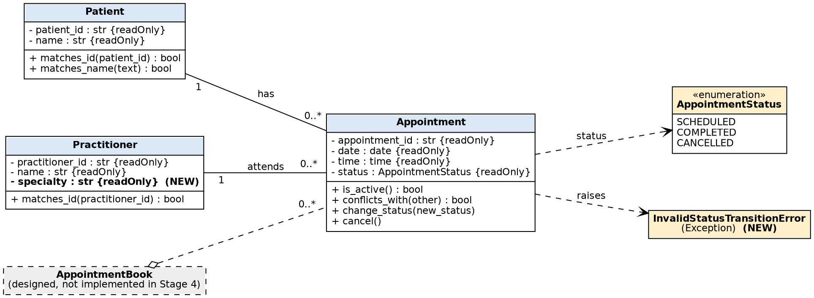

# SmartCare v0.4 - Domain Implementation Workbook

*Design source: SmartCare Domain Model v0.3 (`stage03`). Requirements source: v0.2. Code is in `smartcare/`, tests in `tests/`.*

## A. Approved UML (confirmed before coding)
| Class | Attributes | Operations | Relationships |
|---|---|---|---|
| Patient | patient_id, name | matches_id, matches_name | 1 to 0..* Appointment |
| Practitioner | practitioner_id, name | matches_id | 1 to 0..* Appointment |
| Appointment | appointment_id, date, time, status | is_active, conflicts_with, change_status, cancel | exactly one Patient, exactly one Practitioner, one AppointmentStatus |
| AppointmentStatus | SCHEDULED, COMPLETED, CANCELLED | none | enumeration |

Scope for Stage 4: Patient, Practitioner, Appointment, the enum and one exception. **AppointmentBook stays designed but not implemented** (not asked for in this stage). No database, UI, notification or service classes.

## 1. UML-to-Code Trace
| UML element | Python element | Implemented? | Notes |
|---|---|---|---|
| Patient.patient_id, name | `Patient.patient_id`, `.name` (read-only properties) | Yes | Validated: text, not blank. |
| Patient.matches_id / matches_name | same names | Yes | `matches_name` ignores case (FR-07 is provisional). |
| Practitioner.practitioner_id, name | read-only properties | Yes | Validated like Patient. |
| Practitioner.specialty | `Practitioner.specialty` | Yes (**new**) | Required by the lab brief. It is not in v0.2, so confirm with the client. |
| Practitioner.matches_id | same | Yes | |
| Appointment.appointment_id, date, time | read-only properties | Yes | `date` must be `datetime.date`, `time` must be `datetime.time`. |
| Appointment -> Patient, Practitioner | `patient`, `practitioner` properties | Yes | Held by reference and type-checked. |
| Appointment.status | `status` read-only property | Yes | Starts SCHEDULED. |
| Appointment.is_active | same | Yes | False only when Cancelled. |
| Appointment.conflicts_with | same | Yes | Same practitioner ID, date and time, both active (FR-04). |
| Appointment.change_status | same | Yes | Checked against the allowed-transition table (FR-12). |
| Appointment.cancel | same | Yes | Calls `change_status`. The object is kept (FR-10). |
| AppointmentStatus | `AppointmentStatus(Enum)` | Yes | |
| (new) InvalidStatusTransitionError | `Exception` subclass | Yes (**new**) | The "agreed exception". |
| AppointmentBook | none | **No** | Later stage. |

## 2. Domain Invariants
| Class | Invariant / rule | How protected |
|---|---|---|
| Patient | ID and name are non-blank text and never change. | `require_text` in the constructor, read-only properties. |
| Practitioner | ID, name and specialty are non-blank text and never change. | `require_text`, read-only properties. |
| Appointment | Always has a real Patient and Practitioner, a date and a time. | `isinstance` checks in the constructor (NFR-01). |
| Appointment | Status is always an AppointmentStatus and starts Scheduled. | Set inside the constructor, no setter, `change_status` type-check. |
| Appointment | Only Scheduled can change, to Completed or Cancelled. Completed and Cancelled are final. | `_ALLOWED` table plus `InvalidStatusTransitionError` (FR-12). |
| Appointment | A cancelled appointment is never deleted. | There is no delete operation. `cancel()` only changes status (FR-10). |
| Appointment | Cancelled appointments do not conflict with anything. | `conflicts_with` requires both to be active (FR-04). |

## 3. Composition / Inheritance Decisions
| Relationship | Decision | Rationale |
|---|---|---|
| Appointment and Patient | Association (held by reference) | An appointment *has a* patient. It is not a patient. The patient exists independently. |
| Appointment and Practitioner | Association | Same reasoning. |
| Patient and Practitioner sharing `name`, `ID` | **No `Person` base class.** One shared validation function instead. | Only a validation rule is shared. Their behaviour differs and no requirement needs a common type. |
| Appointment and AppointmentStatus | Appointment holds one status value | An enum is enough because there is no status behaviour. |
| Clinic and Appointment | None | There is no Clinic class and no requirement needs one. |

## 4. AI Pair-Programming Record (Appointment)
Full prompt and log: `ai_engineering_log.md`. First draft kept in `ai_evidence/ai_draft_appointment.py`.

| AI contribution | Conforms? | Decision | Reason | Verification |
|---|---|---|---|---|
| Class skeleton, attributes, `cancel`, `is_active`, enum, exception | Yes | **Accepted** | Matches the UML. | Unit tests |
| Transition table `_ALLOWED` | Yes | **Accepted** | Simple, visible rule (FR-12). | Repeated-cancel test |
| Read-only properties | Yes | **Accepted** | Protects status. | `AttributeError` test |
| `date` and `time` not validated | No | **Modified** | The draft accepted `"2026-11-02"` and `None` (checked by running it). Added type checks. | `test_bad_date_and_time` |
| `change_status` accepted a plain string | No | **Modified** | Weakens type safety. Now rejects non-enum with `TypeError`. | `test_string_status_rejected` |
| Blank-ID check only for falsy values | Partly | **Modified** | A number would crash with `AttributeError`. Reused `require_text`. | Constructor tests |
| `conflicts_with` could return True against itself | Partly | **Modified** | Added `other is not self`. | `test_no_conflict_with_itself` |
| `complete()` | No (not in UML) | **Rejected** | Duplicates `change_status(COMPLETED)` and adds a public operation. | Removed |
| `__eq__` / `__hash__` by ID | No (not in UML or requirements) | **Rejected** | Creates equality semantics nobody asked for on a mutable object. | Removed |
| `__repr__` | No | **Rejected** | Not needed. Removes code (Part G). | Removed |

## 5. Updated UML
Image: `updated_uml.png` (source `updated_uml.dot`). Every change is justified:

1. **Practitioner.specialty added.** The lab requires it. It is flagged because v0.2 never asked for it, so confirm with the client.
2. **InvalidStatusTransitionError added.** Needed to report illegal transitions (FR-12) without returning silent failures.
3. **Attributes marked read-only and typed.** The design now shows how invariants are protected.
4. **AppointmentBook shown as designed but not implemented.** No change to its design.

## Part F - Behaviour checks
Run `python manual_behaviour_checks.py` (output in `ai_evidence/manual_check_output.txt`) and `python -m unittest -v` (**26 tests, all passing**, output in `ai_evidence/unittest_output.txt`).

| Check | Result |
|---|---|
| Valid Patient, Practitioner, Appointment | Created, status Scheduled |
| Blank patient name | `ValueError` |
| `name=None` | `TypeError` |
| Blank specialty | `ValueError` |
| `patient=None` | `TypeError` |
| Date given as a string | `TypeError` |
| Cancel a scheduled appointment | Status Cancelled, object kept, not active |
| Cancel again | `InvalidStatusTransitionError` |
| Cancelled to Completed | `InvalidStatusTransitionError` |
| `a.status = ...` | `AttributeError` (no setter) |

## Part G - Refactor summary
- Removed `complete()`, `__eq__`, `__hash__` and `__repr__` from the AI draft.
- Replaced the `property(lambda ...)` lines with normal `@property` methods.
- Replaced three copies of the blank-text check with one shared `require_text`.
- `cancel()` still reuses `change_status`, so the rules live in one place.
